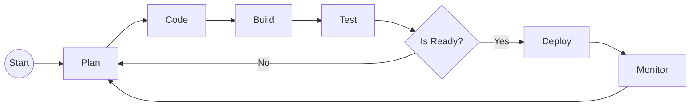

## 🚀 About Me
I'm a **Systems Engineer** by profession, passionate about software development. I'm currently a **Cloud Solutions Engineer** at Oracle and my specialty is **DevOps** scenarios.

## 🛠 Skills
[](https://www.linkedin.com/in/root4j/)

## My Code Language
### Java
```java
package root4j;
public class Hello {  
	public static void main(String []args) {
		System.out.println("Hello World!");
	}  
}
```

### C#
```csharp
using System; 
namespace root4j { 
    public class Hello { 
        public static void Main(string[] args) { 
            Console.WriteLine("Hello World!"); 
        } 
    } 
} 
```

### Go
```go
package main
import "fmt"
func main() {
    fmt.Println("Hello World!")
}
```

## DevOps Flow


## 🔗 Links
[](https://www.linkedin.com/in/root4j/)
