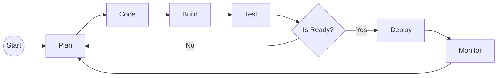

## 🚀 About Me
I'm a **Systems Engineer** by profession, passionate about software development. I'm currently a **Cloud Solutions Engineer** at Oracle and my specialty is **DevOps** scenarios.

## 🛠 Skills
- .NET
- Java
- Go
- Angular
- Flutter
- SQL
- T-SQL
- PL/SQL
- DevOps

## DevOps Flow

## 🔗 Links

